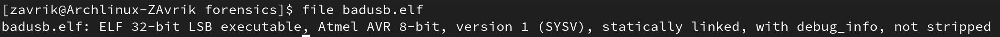
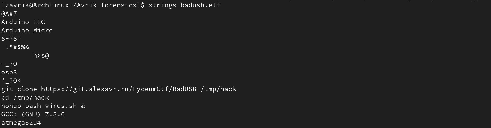
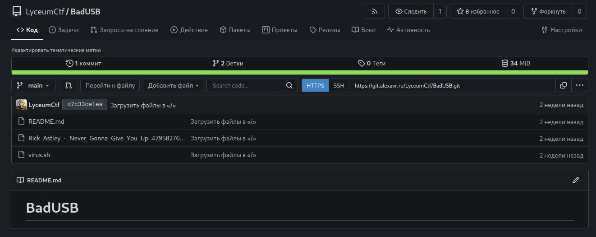
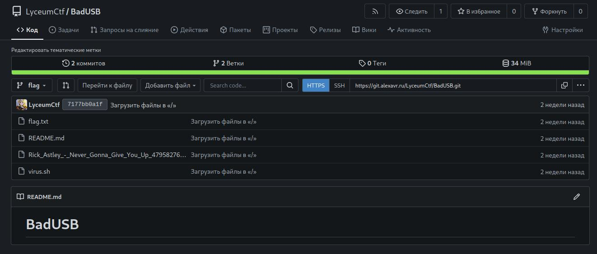

# BadUSB (junior)

## Задание
Недавно я заметил странную флешку в своём компьютере, безопасники сняли дамп, найди претупника!

## Описание
Даётся дамп прошивки ардуино микро. В нём необходимо найти ссылку на скачивание вирусных данных. По этой ссылке расположен гит репозиторий с двумя ветками: main и flag. В ветке flag лежит флаг.

## Решение
### Анализ дампа:
Для начала надо определить, что нам выдали организаторы. Для этого удобно использовать команду `file`:

Становится очевидно, что перед нами прошивка контроллера AVR. Из название и общего кругозора можно представить, что это Arduino Micro / Arduino Leonardo. К сожалению код для неё плохо декомпилируется в общем случае, поэтому попробуем почитать то, что можем прочесть, используя утилиту `strings`:

Теперь стало очевидно, что это действительно Arduino Micro. Также должна заинтересовать строчка `git clone ...`. Это особенно интесно, потому что после идут строчки запуска некоторого скрипта, значит стоит предположить, что мы можем найти исходники на этом репозитории.

### Анализ репозитория:

Зайдём же по ссылке репозитория:

На то, что мы движемся в правильном направлении намекает имя пользователя, владеющего репозиторием - `LyceumCTF`. Однако флаг не лежит ни в описании, ни в `virus.sh`, но можно заметить надпись `2 Ветки`, стоит посмотреть в другой ветке:

Флаг очевидно находится в файле `flag.txt`.
