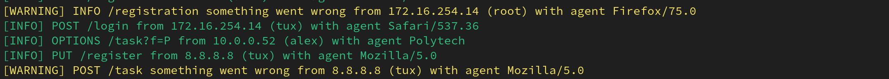

# Веб-сервер

## Задание
Мы смогли украсть логи с веб-сервера, но похоже зря…

## Описание
Даны логи в текстовом формате, надо найти запросы типа OPTIONS и в GET-параметрах будут идти символы флага, надо склеить по порядку.

## Решение
Для начала стоит открыть и просто полистать данный лог в надежде найти что-то примечатльное, и таким может быть строка с параметром OPTIONS, у которого есть странный User-Agent, а также некоторый GET-параметр `f` с одним символом:

Далее с помощью терминала Линукс и некоторых стандартных утилит можем вынуть данную букву и записать в строчку, так и получится готовый флаг:
`cat WebServer.log  | grep OPTIONS | awk -F '[ =]' '{ print $4 }' ORS=''; echo ''`
