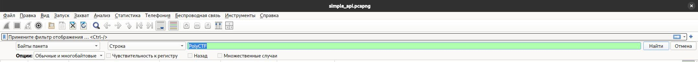

# Простой API-сервер

## Задание
Наш сайт решили заддосить, хорошо, что он устойчив, идентифицируйте хакера!

## Файл к заданию
[simple_api.pcapng](https://polyctf.qookie.tech/SimpleApi/simple_api.pcapng)

## Описание
Необходимо проанализировать запросы, и найти в GET-параметрах одного из них флаг.

## Решение

### 1 Вариант
Воспользуемся программой wireshark и запустим поиск по ключевому слову `PolyCTF`:

### 2 Вариант
Можно воспользоваться мощностями линукс терминала и тем, что файл дампа читаемый:

`strings simple_api.pcapng | grep PolyCTF`
